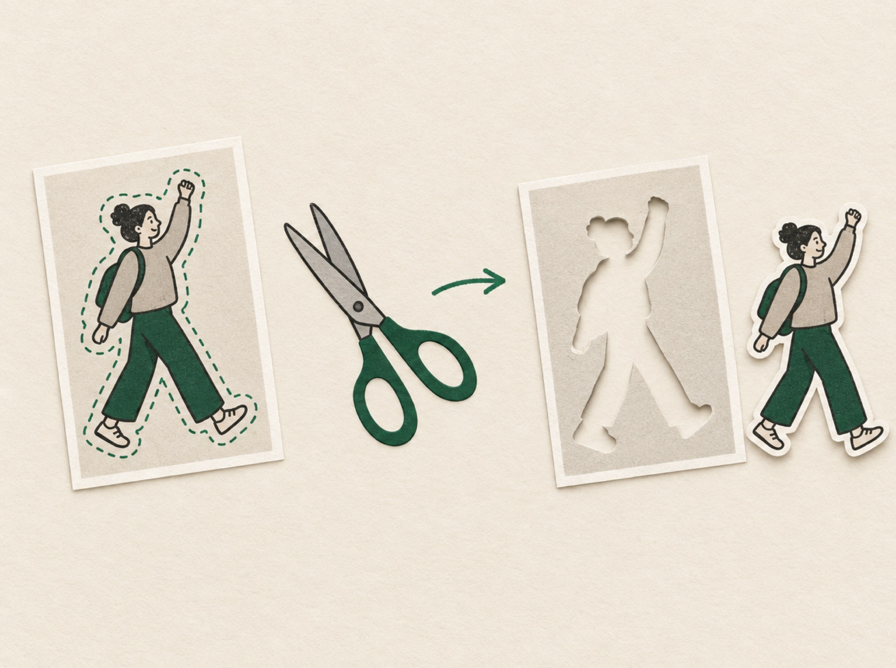

# batch-person-cutout



A Claude skill that cuts people out of a folder of photos and sorts the results by person.
Everything runs locally, so no photo leaves the machine.

It combines a person instance detector (Apple Vision on macOS, torchvision Mask R-CNN elsewhere) with
the BiRefNet matting model via [rembg](https://github.com/danielgatis/rembg). Faces are grouped with
OpenCV's YuNet and SFace models, and you name the groups in a local HTML page.

## Requirements

| | macOS 14+ | Linux | Windows |
|---|---|---|---|
| Person detection | Apple Vision | torchvision | torchvision |
| Needs | Python 3.10+, `curl`, Xcode command line tools (`xcode-select --install`) | Python 3.10+, `curl` | WSL or Git Bash for `setup.sh` |

Disk space: about 1.2 GB for the Python environment, plus about 1 GB for the BiRefNet model.
The torchvision backend adds roughly 1 GB more. Optional: [uv](https://docs.astral.sh/uv/) speeds
up the install; without it the script falls back to `venv` and `pip`.

## Install

Claude Code loads personal skills from `~/.claude/skills/`. Clone the repo there and run the setup:

```bash
git clone https://github.com/gummiz/batch-person-cutout.git ~/.claude/skills/batch-person-cutout
bash ~/.claude/skills/batch-person-cutout/scripts/setup.sh
```

To make the skill available in one project only, clone it into `<project>/.claude/skills/batch-person-cutout`
instead.

The setup creates `.venv/` inside the skill folder, compiles the Vision helper on macOS and downloads
the two face models to `models/`. It is safe to run again. On macOS, add `--with-torch` if you also
want the torchvision backend. BiRefNet itself (about 1 GB) downloads to `~/.rembg` on the first
cutout run, so that run takes longer.

Restart Claude Code, then ask something like "cut out all the people in `photos/` and sort them by
person". The scripts also work without Claude; `SKILL.md` lists the commands.

### Update

```bash
git -C ~/.claude/skills/batch-person-cutout pull
bash ~/.claude/skills/batch-person-cutout/scripts/setup.sh
```

### Uninstall

```bash
rm -rf ~/.claude/skills/batch-person-cutout ~/.rembg/models/birefnet-general
```

torchvision weights, if you installed them, sit in `~/.cache/torch`.

## Licenses

The skill code is MIT. The models and libraries it downloads keep their own licenses:

| Component | License |
|---|---|
| rembg, BiRefNet weights | MIT |
| torchvision (Mask R-CNN weights) | BSD-3-Clause |
| OpenCV, OpenCV Zoo YuNet and SFace | Apache-2.0 |
| Apple Vision | part of macOS |

Ultralytics and insightface are left out on purpose. Their licenses (AGPL-3.0, and non-commercial
model weights) don't suit a skill that is meant to be shared.

This skill handles people only. Object cutouts (products, props) are planned as a separate project.
